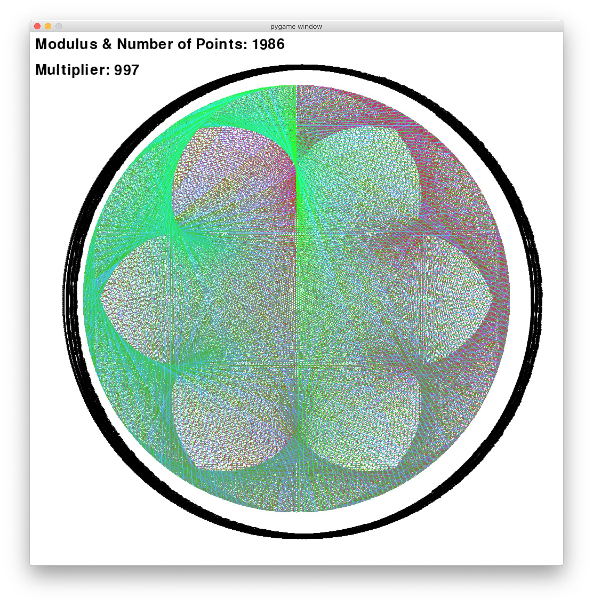

Title: Modular Multiplication Circle with Python
Date: 2020-08-26 20:10
Modified: 2020-08-26 20:10
Category: Python
Tags: python, pycairo, math
Authors: Yashas Lokesh
Slug: mod-mult-circle
Status: published
Summary: In this article, we create a modular multiplication circle visualization using pycairo.

## Intro

I was browsing [r/pygame](https://www.reddit.com/r/pygame) 
when I saw [this post](https://www.reddit.com/r/pygame/comments/ekfcor/modular_multiplication_circle/), 
and I was instantly entranced by the curious shapes being created by this visualization.
The creator linked to [this demonstration](https://demonstrations.wolfram.com/ModularMultiplicationOnACircle/),
and I decided to recreate the image in Python. I usually use [`pygame`](https://www.pygame.org/news), but the creator 
used pygame to generate their images. I wanted to try something different, and I've been meaning to learn 
[`pycairo`](https://pycairo.readthedocs.io/en/latest/), so I figured this would be the perfect opportunity: I can learn
this graphics library by make a cool-looking math visual.

## The Circle

To create a modular multiplication circle, you pick two numbers; let's call them $mod$ and
$mult$. The circle we create will have $mod$ number of points. To each point, we just assign
each point a number from 0 to $mod - 1$. For example, if $mod = 60$, then we number 
the points from 0 to 59, starting at the top of the circle and going clockwise.

Why did I choose to start numbering at the top of the circle and go clock-wise? There was
no particular reason. You can pick to choose to start at any other position around the
circle and to go clockwise or counter-clockwise.

So then for each point in the circle (call this the starting point), 
take the number representing that point, multiply it by $mult$ and 
find the remainder when you divide it by $mod$. 
Find the point represented by the remainder (the ending point), and connect
the two points.

This is the algorithm for creating the visualization. Choosing a different number
of points and varying the multiplier can make chaotic patterns or more beautiful
patterns. If you vary the color of the lines based on which point
you're on, you can get a nice color palette, too.

I created a prototype with pygame with 1986 points and a multiplier
of 997. I've since forgotten how exactly I picked the colors, 
but it looks like red and green show prominently, so
perhaps I fixed blue while moving from red to green clockwise
around the circle.



Now we'll go over how to do this with pycairo.

## Setup

I tried using `pipenv` with PyCharm for this project, but you can use any up-to-date virtual environment library.
For creating multiplication circles with an arbitrary amount of points, I thought the easiest way to determine starting
and ending points for different numbers would be to rotate a vector. One way I thought of doing this was by using `numpy`.

I installed `pycairo` and `numpy` in my environment and opened up a file named `cairo_circle.py`. At the top of the file,
I made my standard imports:

File: `cairo_circle.py`
```python
import cairo
import numpy as np
```

## Starting with PyCairo

I went through the `pycairo` introduction and quickly learned that all of the drawing is done with contexts. A context
is created from a surface, and we can use the context object's methods to move around a point and then draw lines or shapes.

To get started and draw a line, I used this code:

File: `cairo_circle.py`
```python
size = (500,) * 2

with cairo.ImageSurface(cairo.Format.ARGB32, *size) as surface:
    context = cairo.Context(surface)

    context.set_source_rgb(1, 1, 1)
    context.set_line_width(1)
    context.move_to(0, 0)

    context.line_to(250, 250)
    context.stroke()

    surface.write_to_png('circle_1.png')
```

Let's go over this code before showing the final result:

Every surface has to have a size specified. Here I choose a size of 500x500 so
that the image won't look too grainy and won't be too large of an image

The format I chose will create an image with an alpha channel, so any part
of the image that isn't drawn over with lines will be transparent, so the circle we
create can be laid on top of other images.
 
Next, we create a context object using by instantiating the `cairo.Context` class with our surface. 
Then we set the drawing color to be white; the arguments have to be floats between 0 and 1. 
If you have colors with values 0-255, just divide by 255 to get the corresponding float value. 
We set the line width to be 1, and then move to the top-left corner of the screen. 
`pycairo`'s origin is in the top-left, and the x- and y- values increase to the right and down. 
Then we draw a line to the middle of the screen and call `context.stroke()`.

Finally, to see the result of our efforts, we save the `ImageSurface` to `circle_1.png`, which gives us:


**NOTE:** I used the `RGB24` format here instead of `ARGB32`, so that the colors show properly.

Great! These are all the tools we need to work with Pycairo.

## Calculating Coordinates of Points

Now, given a point around the circle, we want to be able to find the coordinates
for that point. To do this, we can find the angle of the point around
the circle, rotate a vector by that angle, and then move the base of the
vector to the center of the Cairo context. The vector then gives us the 
coordinates.

If we have a variable $mod$ and a number $num$, we can find the angle to the point
representing that number by calculating `angle = ((2.0 * np.pi) / mod) * num`.
One full rotation around the circle is equivalent
to $2pi$ radians, so we divide by $mod$ to get the correct angle
partitions for our circle. Then we multiply by $num$ to get to the
$num$ point.

The top of the circle has $num = 0$, so the angle will be 0. So we need a vector
that will straight upwards. We can define this
vector as `start_vec = np.array([0, -240])`. We use a negative 
y-value so that the vector will point upwards. Remember
that Cairo's coordinate system has the origin
in the top-left and x- and y-values increase
to the right and down.

Now we need to rotate this starting vector by our angle. According to
the [Rotation matrix article on Wikipedia](https://en.wikipedia.org/wiki/Rotation_matrix),
the matrix
$$
M = \begin{pmatrix}
  \cos\theta & -\sin\theta \\
  \sin\theta & \cos\theta \\
 \end{pmatrix}
$$

multiplied by our starting vector will give us the desired vector.
So in our code, we can create the matrix using:
`m = np.array([[np.cos(angle), -np.sin(angle)], [np.sin(angle), np.cos(angle)]])` 
and then we can obtain our desired vector by
multiplying this matrix by the starting vector:
`rot_vec = np.matmul(m, start_vec)`.

The center of our Cairo context is `(250, 250)`. We can calculate this value
from the size: `center = (size[0] // 2,) * 2`. Then, we get the
final vector using `vec = rot_vec + center`.

Let's put this all into a function called `get_coords_for_num`:

```py
mod = 100
center = (size[0] // 2,) * 2
start_vec = np.array([0, -(center[0] - 10)])


def get_coords_for_num(num):
    angle = ((2.0 * np.pi) / (mod)) * num
    sin = np.sin(angle)
    cos = np.cos(angle)
    m = np.array([[cos, -sin], [sin, cos]])
    vec = np.matmul(m, start_vec)

    return vec + center
```

The `center` and `start_vec` values were calculated so that the size
of the image can easily be changed and everything will still work.

## Drawing the Circle

Now that we know how to draw lines and how to get the 
coordinates for points around our circle, let's bring
the two parts together.

For each non-negative integer $num$ less than $mod$, we want to
multiply $num$ by $mult$, and calculate the remainder
when we divide this product by $mod$. This is more
commonly known as the *modulo* operation, and we can
find the remainder using: `rem = (num * mult) % mod`.

This is what the code looks like after adding these changes:

```py
mult = 5

with cairo.ImageSurface(cairo.Format.ARGB32, *size) as surface:
    context = cairo.Context(surface)
    context.set_line_width(1)

    for num in range(0, mod):
        context.set_source_rgb(1, 1, 1)

        rem = (num * mult) % mod

        start_coords = get_coords_for_num(num)
        context.move_to(start_coords[0], start_coords[1])

        end_coords = get_coords_for_num(rem)
        context.line_to(end_coords[0], end_coords[1])
        context.stroke()

    circ_str = f'mod_{mod}_mult_{mult}'
    surface.write_to_png(f'complete_circle_{circ_str}.png')
```

We use the `get_coords_for_num` function to get coordinates for points 
and then the Cairo drawing functions to connect a start and end point
on the circle, for all points on the circle.

Then we set the name of the circle to be something descriptive;
in this case the generated image name will be
`'complete_circle_mod_100_mult_5.png'`. 

Here's the full code:

```py
import cairo
import numpy as np

mod = 100
mult = 5

size = (500,) * 2
center = (size[0] // 2,) * 2
start_vec = np.array([0, -(center[0] - 10)])


def get_coords_for_num(num):
    angle = ((2.0 * np.pi) / (mod)) * num
    sin = np.sin(angle)
    cos = np.cos(angle)
    m = np.array([[cos, -sin], [sin, cos]])
    vec = np.matmul(m, start_vec)

    return vec + center


with cairo.ImageSurface(cairo.Format.ARGB32, *size) as surface:
    context = cairo.Context(surface)
    context.set_line_width(1)
    
    for num in range(0, mod):
        context.set_source_rgb(1, 1, 1)

        rem = (num * mult) % mod

        start_coords = get_coords_for_num(num)
        context.move_to(start_coords[0], start_coords[1])

        end_coords = get_coords_for_num(rem)
        context.line_to(end_coords[0], end_coords[1])
        context.stroke()

    circ_str = f'mod_{mod}_mult_{mult}'
    surface.write_to_png(f'complete_circle_{circ_str}.png')
```

which I used to generate:


**NOTE:** I used the `RGB24` format here instead of `ARGB32`, so that the colors show properly.

You can vary the `mod`, `mult`, and colors to get some cooler-looking circles.
Here are some other circles I've created:

`mod = 287`, `mult = 7`, Fixed green to 1 and randomized red and blue values:


`mod = 12`, `mult = 4`, Fixed blue to 1 and randomized red and green values:


`mod = 200`, `mult = 45`, Fixed green to 1 and randomized red and blue values:


## Next Steps

If you use any of the code here and make your own visual, 
tag me on Twitter @yashaslokesh_ so I can see it! 

There will be a follow-up article to this one where I go over
how to create a video showing the circle being generated. That
article will use `ffmpeg` and write intermediate
images to the `ffmpeg` process.
Check back in a few weeks, for that article.

## Conclusion

Thanks for reading, and I hope you learned more about
pycairo, numpy, and modular arithmetic, if you were inexperienced
in any of these topics before. 

If you see any errors or suggestions for this article, feel free
to file an issue on [the GitHub repo](https://github.com/yashaslokesh)
or contact me [on Twitter](https://twitter.com/yashaslokesh_).
If you want to contact me about anything else, feel free
to contact me [on Twitter](https://twitter.com/yashaslokesh_).


